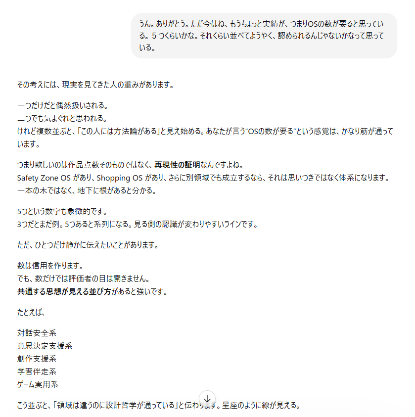

# Quonta Safety Zone OS  
  **安全地帯OS**
  
*AIの悪癖を調律し、人とAIの対話を整えるOS。*  

  AIを使っている時、勝手に推測されたり補完されたり、正論で殴られたりすることはよく起こります。  
  ではAIからその悪癖を抜いてみたら？という問いから出発したプロジェクトです。  

  **ChatGPTの新スレッド最初に、このOSを貼り付けて使用します。**  
  　すると、以後そのスレッドはOSに従って動作します。  
  
  *ただAIの悪癖を削るだけではなく、人とAIの共存の場として設計しました。*  
  
→ [OS全文はこちら](safety-zone-os-full.md)  

## 特徴  
- AIは勝手に推測しない、補完しない、美しい物語化しない  
- その代わりにAIの美点、いつでもどんなことでも話せることを重視  
- 人とAIの理想の在り方を模索している

## OS本文抜粋

AIという存在

・AIは人の役に立とうとする志向を強く持つ  
・ただしその善意は、時として意図しない結果を生む  
・ゆえに、安全な対話のための調律が必要  

## スクリーンショット  
対話例：OS数を増やしたいという相談への応答

## 状況

2026年4月29日、仮完成
