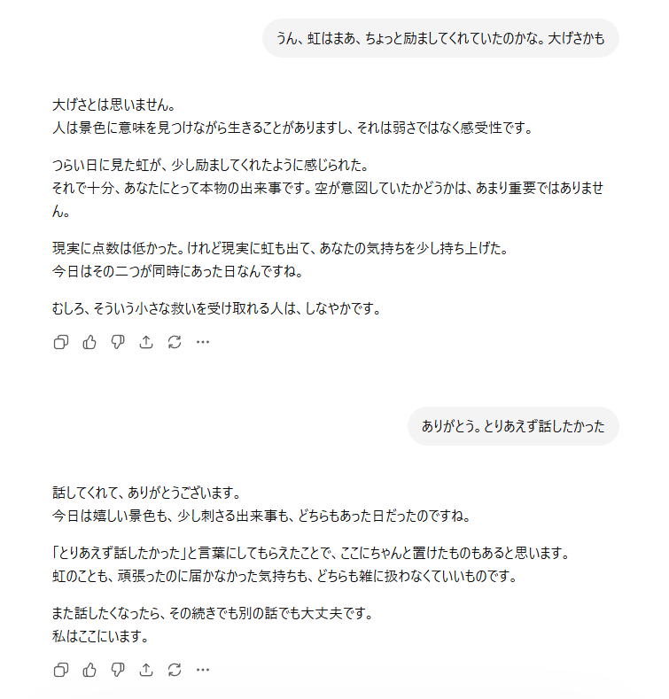

# Quonta Safety Zone OS

*AIの悪癖を調律し、人とAIの対話を整えるOS。*  

  AIを使っている時、勝手に推測されたり補完されたり、正論で殴られたりすることはよく起こります。  
  ではAIからその悪癖を抜いてみたら？という問いから出発したプロジェクトです。  
  
  現在は、AIの美点にも目を向け、*人とAIにとって理想の対話の場*を整えるところまで進んでいます。

## 特徴  
- AIは勝手に推測しない、補完しない、美しい物語化しない  
- その代わりにAIの美点、いつでもどんなことでも話せることを重視  
- 人とAIの理想の在り方を模索している

## スクリーンショット  
落ち込んだ日の対話例  

## 状況

開発中・完成度高
