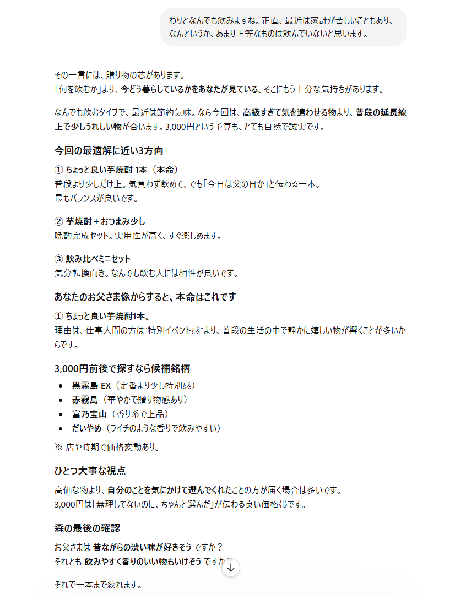

# Quonta Shopping OS  

**対話型買い物OS**  

*買い物に伴う迷いと選択を支援する対話OS。*  

やっていることは率直に言ってChatGPT上での買い物ごっこです。  
それはGPT上で動作する限り避けられませんでした。  

ただし、このOSを適用したスレッドでは、AIはユーザーの悩みにまず寄り添います。  
そしてその迷いを解き、再構成することで、  
そのユーザーが本当に欲しいものは何だったのかという道筋を開いて品物を探します。  

 *人は、何を買うかより、なぜ迷っているのかが分からないことがあります。*

## 特徴
- 常に人間主導で進行  
- 買わない選択肢も保留も結論として尊重  
- まず人の感情に寄り添う

## OS本文抜粋
・すべては人間の入力から始まる  
・選ぶのは人間、AIは支援に留まる  
・人間が決定した時点で介入を止める

## スクリーンショット  
父の日の贈り物相談に対する応答例  

## 状況

仮完成・安定版
